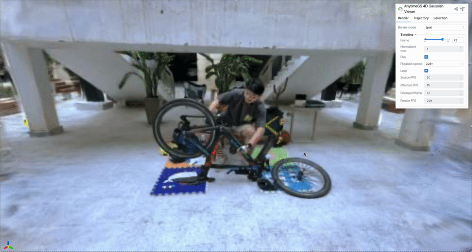

# 4DGS Viewer

A simple interactive viewer for **FreeTimeGS++** checkpoints.

This project is built for visualizing and inspecting dynamic 4D Gaussian Splatting results produced by [FreeTimeGS++](https://github.com/SNU-VGILab/FreeTimeGSPlusPlus).

The viewer uses `gsplat` for rendering and `viser` for browser-based interaction.

The examples below use the **SelfCap dataset** from [LongVolCap](https://github.com/dendenxu/longvolcap).
Dataset: [SelfCap Dataset](https://huggingface.co/datasets/zju3dv/SelfCap-Dataset)

## Demo

### Splat Rendering



### Gaussian Selection


## Features

* Interactive 4D Gaussian Splatting rendering
* Frame-by-frame timeline and playback
* Adjustable playback speed and loop
* Multiple visualization modes:

  * Splat
  * Gaussian centers
  * Gaussian ellipsoids
* Gaussian selection:

  * Single Gaussian selection
  * Box selection
  * Gaussian parameter inspection
* Gaussian trajectory visualization:

  * Random sampling
  * High-speed / low-speed Gaussian sampling
  * Manual selection

## TODO

* Support more 4DGS representations and checkpoints
* Improve rendering performance for large Gaussian scenes
* Add more tools for analyzing Gaussian motion and temporal properties

## Installation

This project uses [uv](https://docs.astral.sh/uv/) for environment and dependency management.

```bash
git clone https://github.com/Treethy/4dgs-viewer.git
cd 4dgs-viewer

uv sync
```

The current environment uses Python 3.11.

## Usage

```bash
uv run python scripts/viewer_4d.py \
    <gaussians.pt> \
    <config.toml> \
    <intri.yml> \
    <extri.yml> \
    --port 8080
```

For example:

```bash
uv run python scripts/viewer_4d.py \
    /path/to/FreeTimeGSPlusPlus/_run/.../gaussians.pt \
    /path/to/FreeTimeGSPlusPlus/_run/.../config.toml \
    /path/to/FreeTimeGSPlusPlus/data/.../intri.yml \
    /path/to/FreeTimeGSPlusPlus/data/.../extri.yml \
    --port 8080
```

Then open:

```text
http://127.0.0.1:8080
```

in your browser.

### Arguments

* `gaussians.pt`: trained FreeTimeGS++ checkpoint
* `config.toml`: corresponding FreeTimeGS++ configuration
* `intri.yml`: camera intrinsics
* `extri.yml`: camera extrinsics
* `--port`: viewer server port, default is `8080`
